# Working with AWS SCT Extraction Agents

## Installing and Configuring the AWS SCT Extraction Agents

In this step, we will install and configure the AWS SCT Extraction Agents on two  Linux hosts. SSH to the  Linux host using the IP address and private key as mentioned in the below steps.

### Steps for SSH login to Agent Extractor hosts

If you are using windows, please follow the instructions here: http://docs.aws.amazon.com/AWSEC2/latest/UserGuide/putty.html

1.	Login to AWS Management Console and note the public IP address of Agent1 instance.

    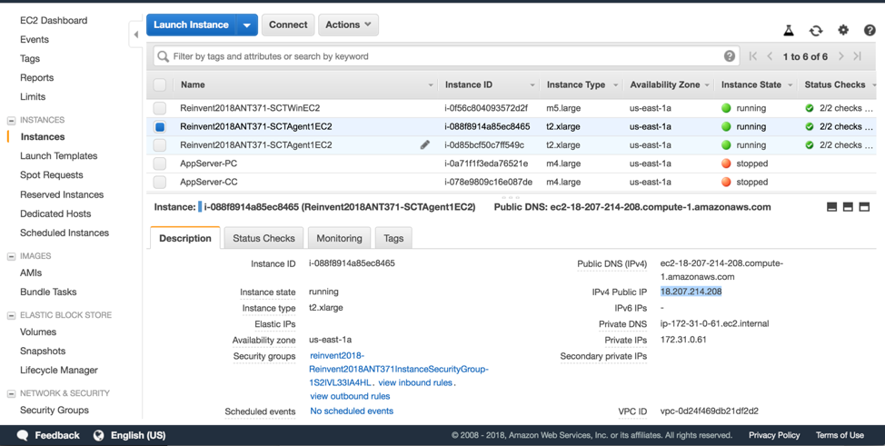

2.	Open the “Terminal” application    in Mac and go to the location where you saved the EC2 Private Key (.pem) file

    > Execute below SSH command to connect to AWS SCT Extraction Agent EC2 host.   Please remember to replace with your Keypair file Name and the Public IP address of your EC2 instances.

    > ``` ssh -i <keypair_file_name> ec2-user@<public-ip-address-of-agent-host> ```

3. Once you are connected to Agent Host using SSH, perform the below steps from the terminal to install and configure the AWS SCT Extraction Agent.

    > **NOTE:** The agent rpm executables and JDBC driver files have been copied to appropriate locations.

4. Run below commands from the terminal to install the agent

    >
      ```
      cd /home/ec2-user/agents
      sudo rpm -ivh aws-schema-conversion-tool-extractor-1.0.620-1.x86_64.rpm
      ```

5.	Execute the following command to configure the SCT Extraction Agent

    >
      ```
      /usr/share/aws/sct-extractor/bin/sct-extractor-setup.sh -configuration
      ```
    Specify values for the properties as highlighted below:

    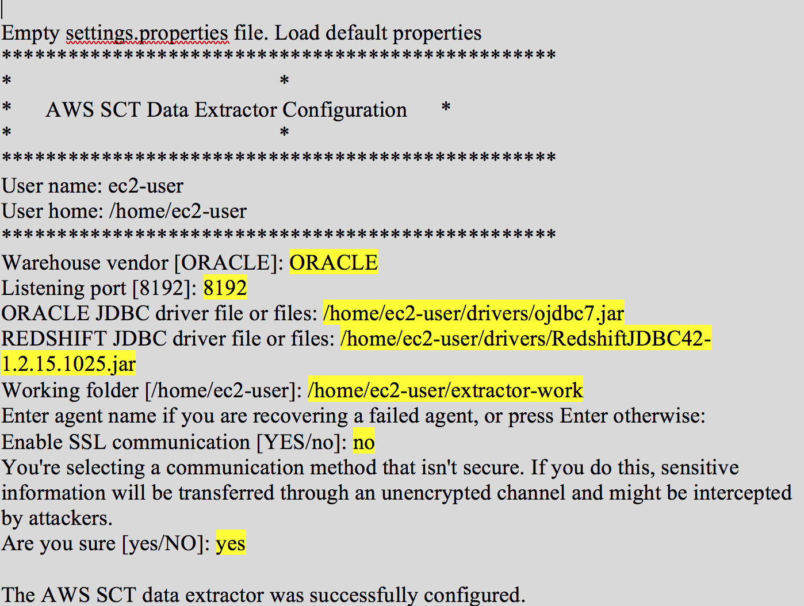

    **NOTE:**  We selected “no” for “Enable SSL communication” option while configuring the AWS SCT Extraction Agent. This is ONLY for the lab purposes. When you are migrating the production data warehouses on AWS, it is highly recommended to enable SSL communication between the Extraction Agents, AWS SCT, and the source and target database.

6.	Run the following command to start the Extractor Agent on Host 1

    ``` sudo service sct-extractor start ```


### Steps for Installing and Configuring the SCT Extraction Agents on Host 2

***Please repeat the previous steps (1 to 5)  to configure the SCT extractor agent on host 2.***

### Registering Extraction Agents with AWS SCT tool

Now that we have SCT Extraction Agent installed, configured and started on both the hosts successfully, we can register them with the AWS SCT tool.

Please follow below steps to register Agents with AWS SCT:
1.	Connect to Windows server using RDP client and open AWS Schema Conversion Tool.

2.	Select View -> Data Migration View

    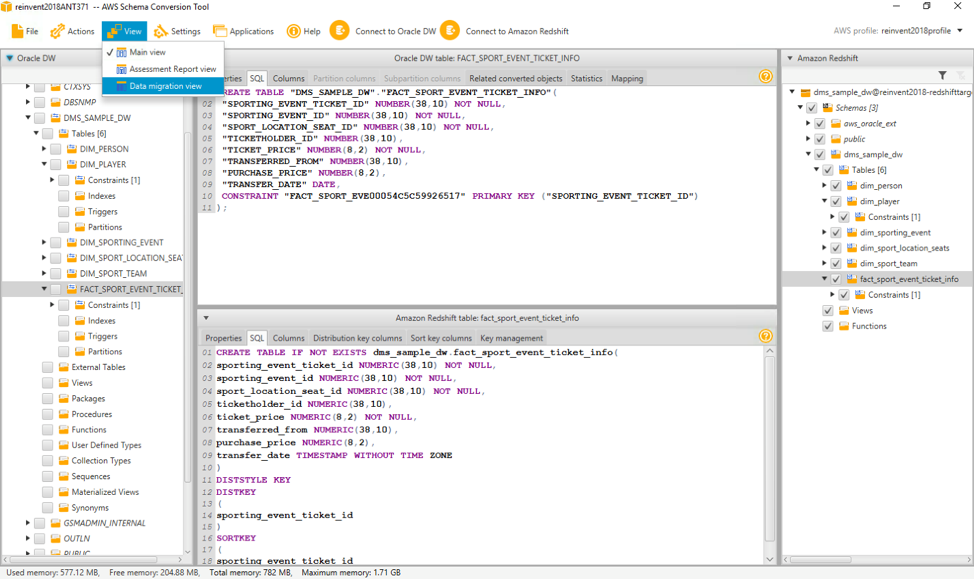

3.	From the central panel, click “Register” button under “Agents” tab.

    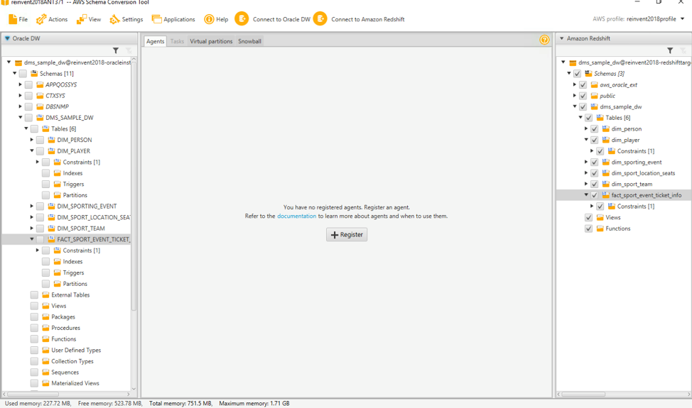

4.	Fill-in the required details for Agent registration as shown below:

    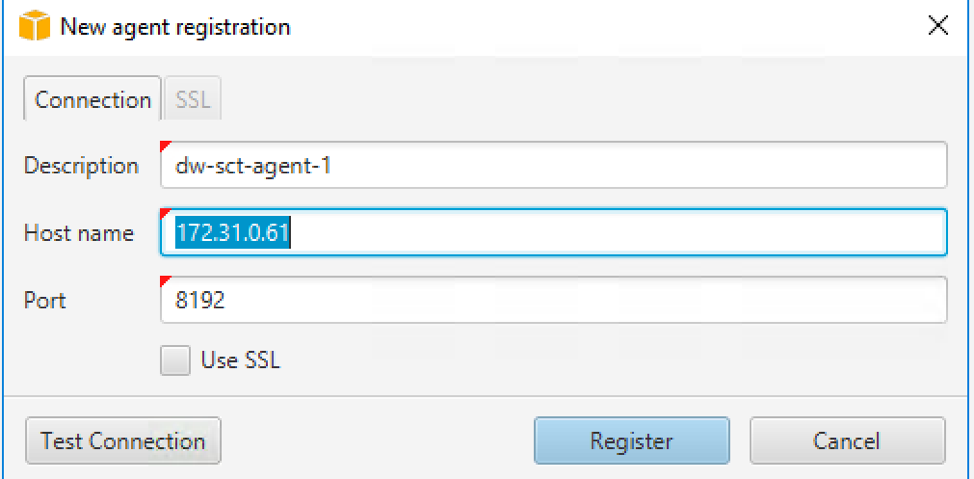

    **Note:** that Hostname is the Private IP Address of your Hosts on which SCT Extractor Agent is running. This address can be obtained from Amazon EC2 console UI or from “Reinvent2018ANT371AGENT1PrivateIP” and “Reinvent2018ANT371AGENT2PrivateIP” outputs in the CloudFormation console.

5.	Click on “Test Connection”

    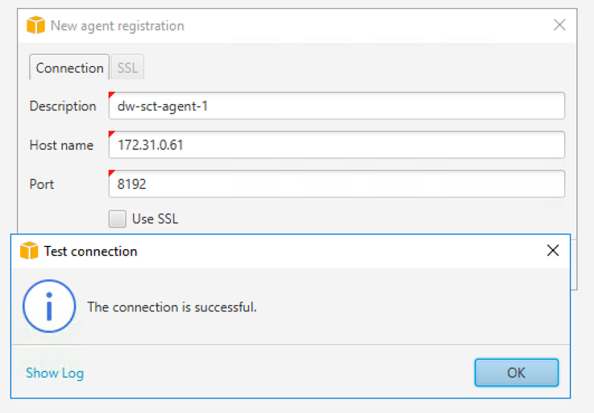

6.	Click on “Register” to register the agent with the AWS SCT tool

    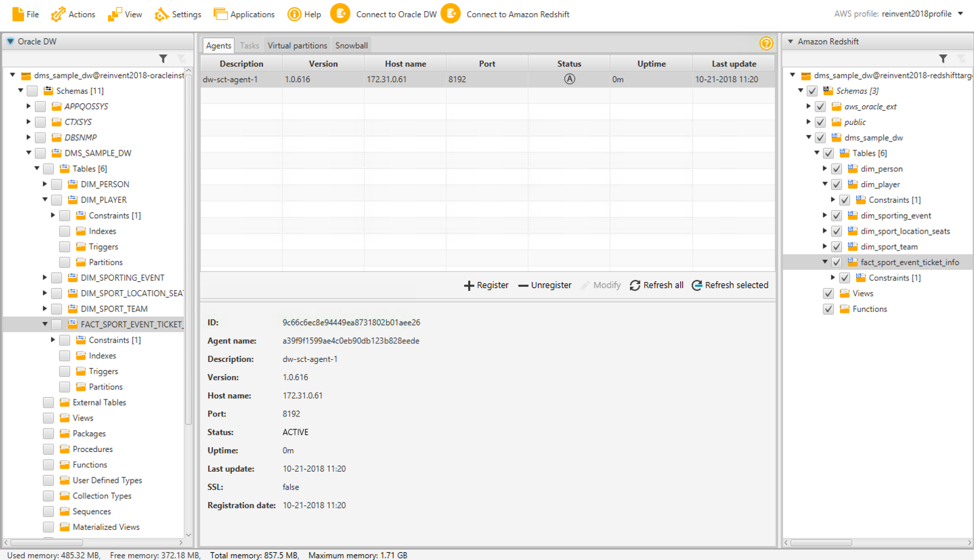

7.	Register another agent running on host2 with the AWS SCT tool using the same steps as above.   You should see two  SCT extraction agents registered in AWS SCT console as given below:

    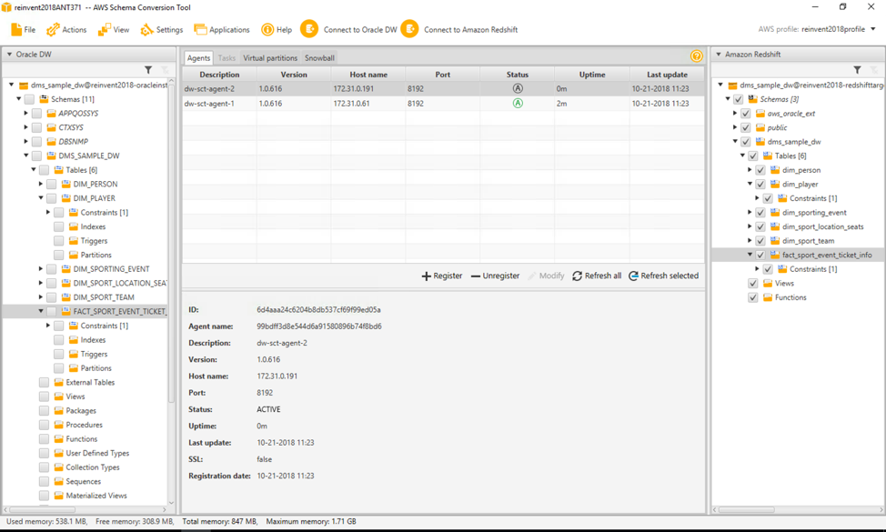

    Note that, in order to connect to AWS SCT Extractors Agents from AWS SCT GUI, entries are already made in the Security Groups associated with Agent hosts in CloudFormation template.

## Creating, Running and Monitoring the AWS SCT Data Extraction Tasks

You can select one or more tables to be migrated at a time when creating Data Extraction Tasks. You can choose all tables, but we recommend against that for performance reasons. We recommend that you create multiple tasks for multiple tables based on the size of the tables in your data warehouse.

1.	In the AWS SCT application UI, for the current reinventANT371 project in the source oracle  database tab,  select all the tables under the ***“DMS_SAMPLE_DW”.***  

    Now ***uncheck*** only the  ***“DIM_PERSON”*** tables. This table is very large and we will be using Virtual Partitioning feature to migrate these tables to Amazon Redshift.  Overall the final table selection for migration would look like the screenshot below:

    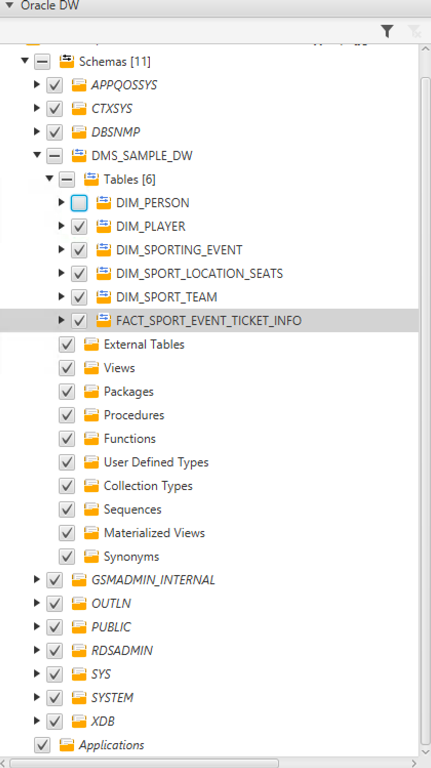

2.	Right Click the “Tables” node and select “Create Local Task”.  If the “Create Local Task” is not enabled, then click on “Connect to Oracle” button on top of the AWS SCT Window.

    

3.	In the “Create local task” window, fill-in the required details as shown below:

    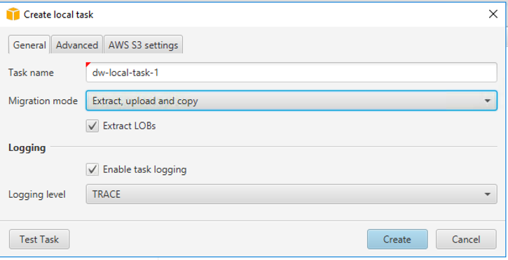

    For Migration Mode, you can choose one of the following:
      * Extract Only – Extract your data and save the data to your local working folders.
      *	Extract and Upload – Extract your data and upload your data to Amazon S3.
      *	Extract, Upload and Copy – Extract your data, upload your data to Amazon S3, and copy it into your Amazon Redshift data warehouse.

    In this lab, we will select the third option, i.e. “Extract, upload and copy”.

     This will extract the data from Oracle data warehouse, move it to Amazon S3 and load the data into Amazon Redshift using COPY command.

4.	Click ‘Test Task’. ‘Test Validation Passed’ message is displayed.

    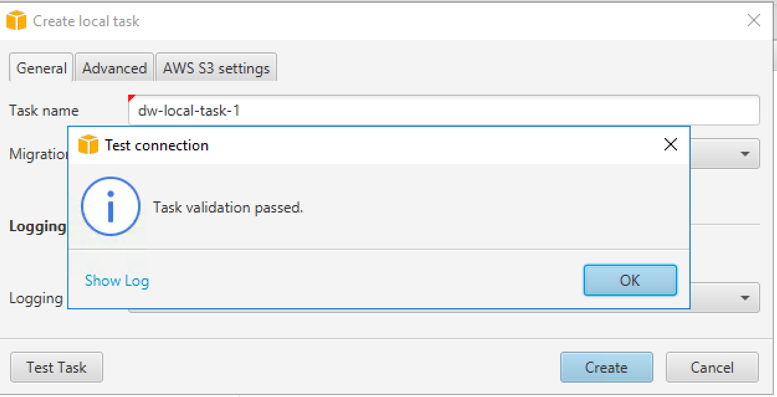

5.	Go through various options available under “Advanced” and “AWS S3 settings” tabs.

    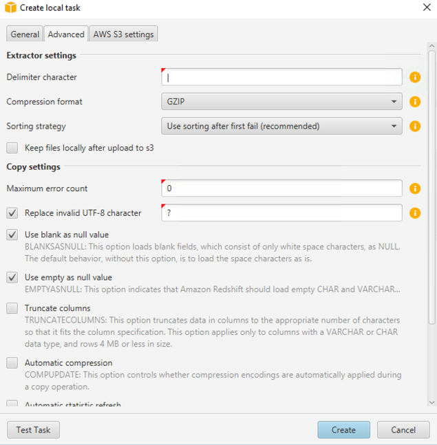

    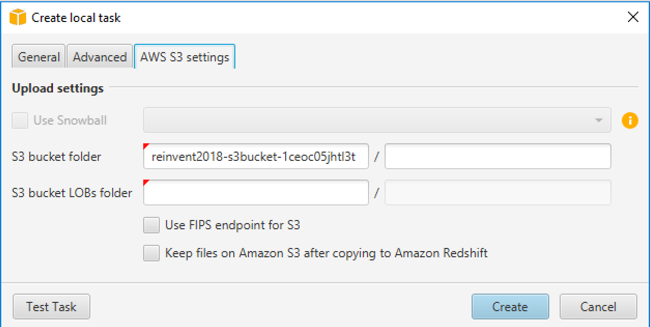

6.	Click on ‘Create’ button to create the extraction task.

    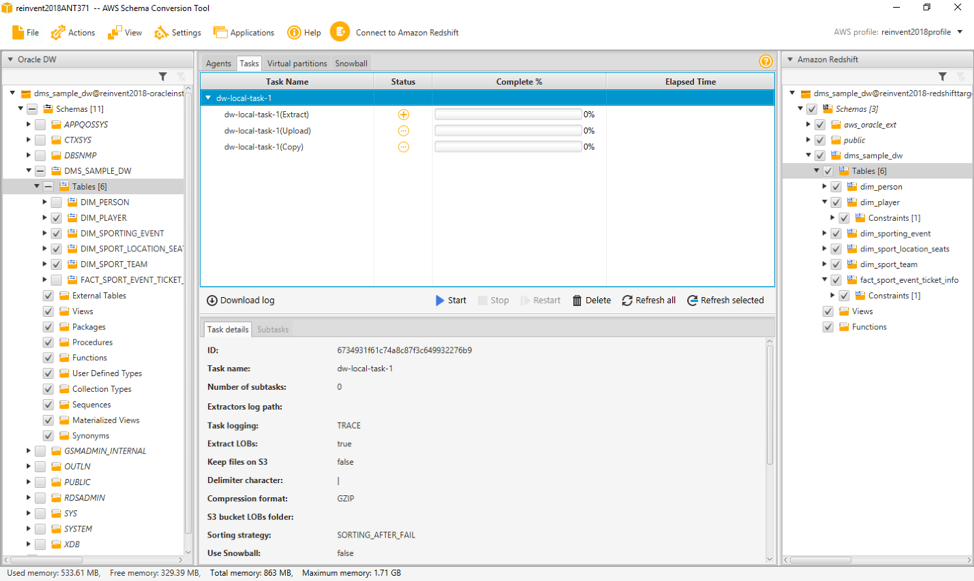

7.	Select the task in AWS SCT and press “Start” to start the migration from Oracle data warehouse to Amazon Redshift.

    

    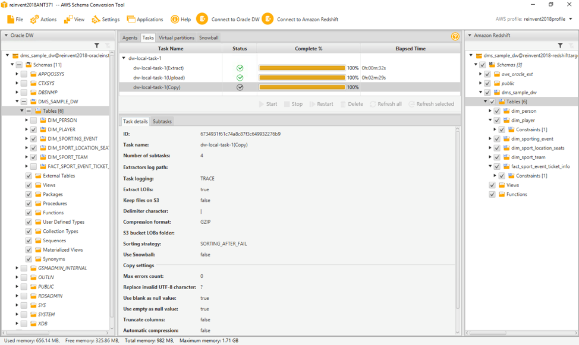

8.	Observe that the “Extract” and “Upload” steps are executed in parallel.

9.	 Click on each step (Extract, Upload, Copy) in the AWS SCT UI and select “Subtasks” tab.
    Observe that for each table a separate subtask is created.

        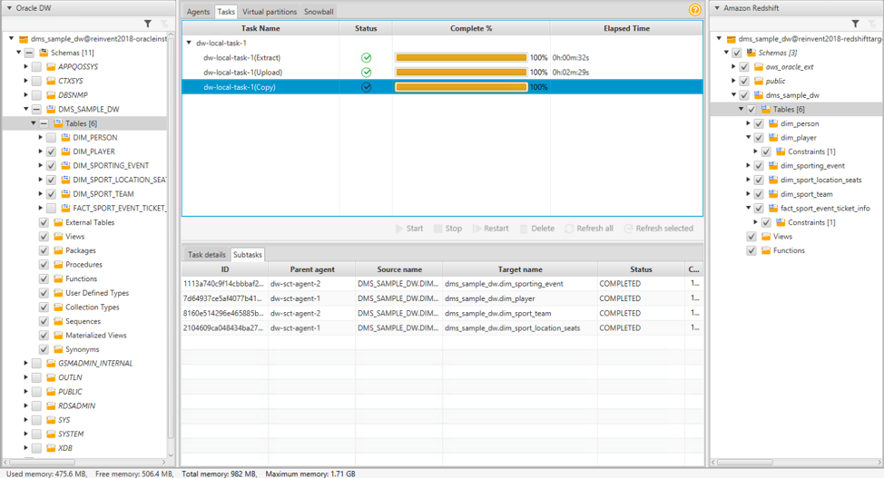

    The subtasks have been distributed between the two extractor agents we had registered with the AWS SCT.

## Migrating Large Tables using the Virtual Partitioning Feature

In AWS SCT, you can create virtual partitions for migrating your data. There are three partition types, which work with specific data types:
    •	The RANGE partition type works with numeric, date, and time data types.
    •	The LIST partition type works with numeric, character, and date and time data types.
    •	The DATE AUTO SPLIT partition type works with date and time data types.

For more information on Virtual Partitioning, please refer to AWS Documentation at this [page](https://docs.aws.amazon.com/SchemaConversionTool/latest/userguide/CHAP_Agents.DW.html):  

#### Using RANGE Virtual Partitioning to Migrate the PERSON Table

Steps:
1.	Uncheck all objects from DMS_SCHEMA_DW schema from source side in the AWS SCT UI

2.	Select ‘DIM_PERSON’ table, right click and select ‘Add Virtual Partitioning’.

    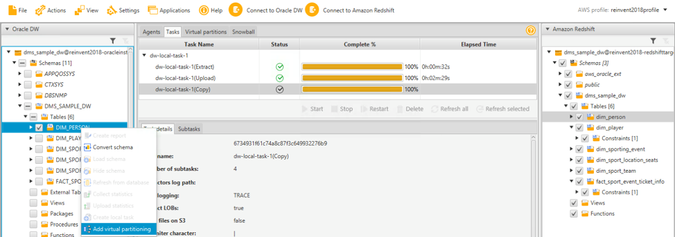

3.	Select ‘Range’ for the ‘Partition Type’ option.

    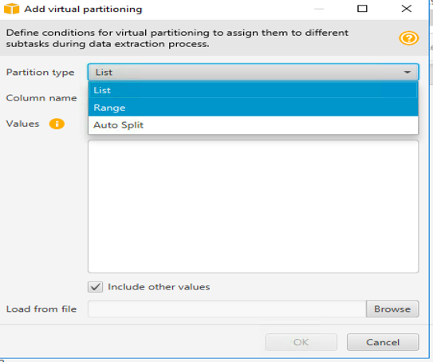

4.	Select the ID Column, Enter Value as ‘1000000’ and click on ‘+’ icon or press enter.

5.	Similarly add the 2000000, 3000000 values and press enter.

    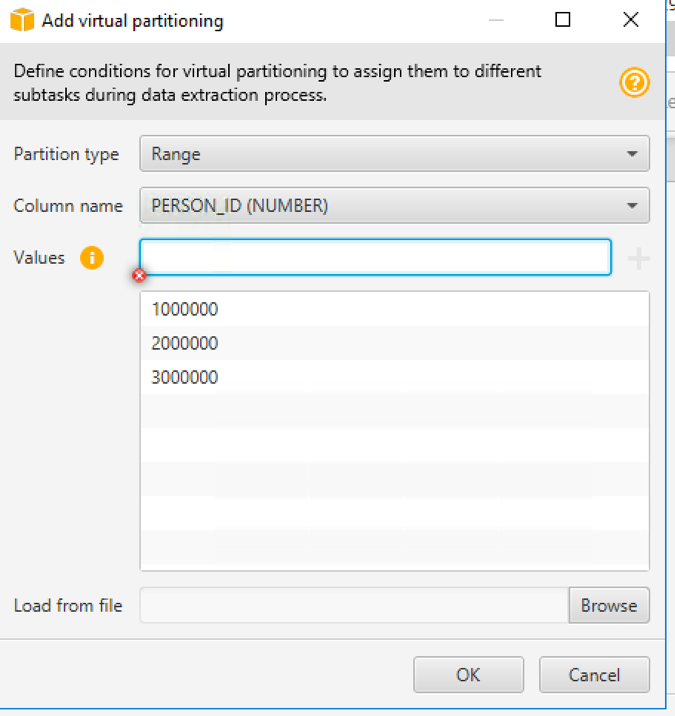

    **Note** the details displayed under ‘Virtual Partitions’ tab in SCT.

    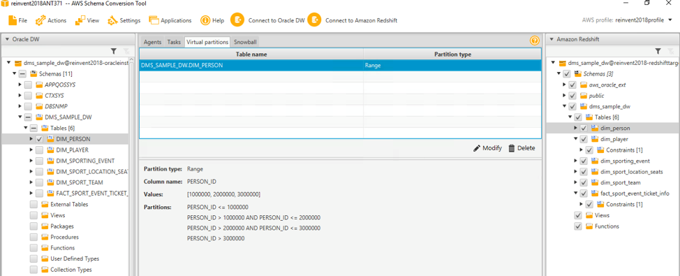

    We will now migrate the data in ‘RANGE – Virtual Partitioned’ table ‘DIM_PERSON’ to Amazon Redshift.

6.	Right Click the “DIM_PERSON’” table in AWS SCT and select “Create Local Task”. The required steps would be similar to the ones for migrating the other tables in the previous section.    Please select ONLY the ‘DIM_PERSON’ table.

    

    

7.	Click on the “Start” button above to start the AWS SCT Extractor Agent Task from the tool.

8.	Click on a specific Task (such as Extract or Upload) in SCT UI and navigate the “SubTasks” tab.

    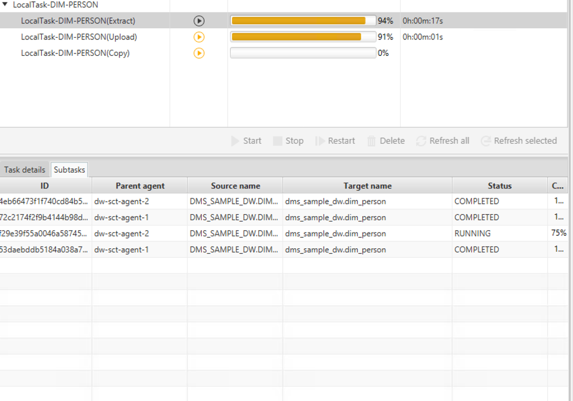

    You will see that there are four threads running in parallel to extract and move the data to the Amazon S3 bucket. This is because we have created four virtual partitions for the “DIM_PERSON” table. These 4 concurrent threads are divided equally between 2 agents.

  **NOTE:** To move data into Amazon Redshift directly, you would select “Extract, Upload and Copy’ option while creating the task.
